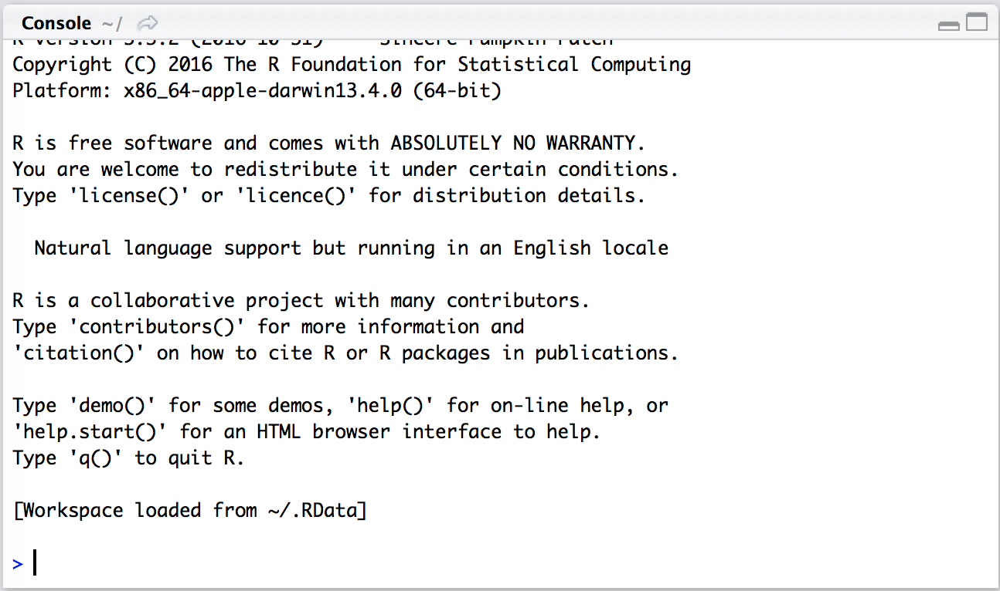
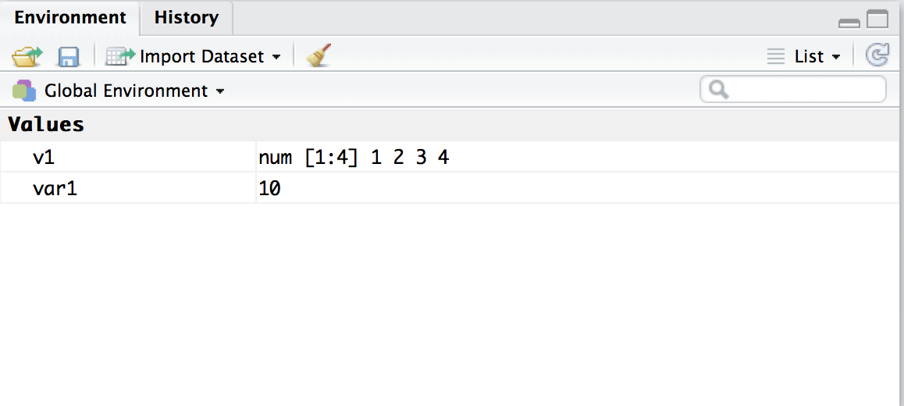
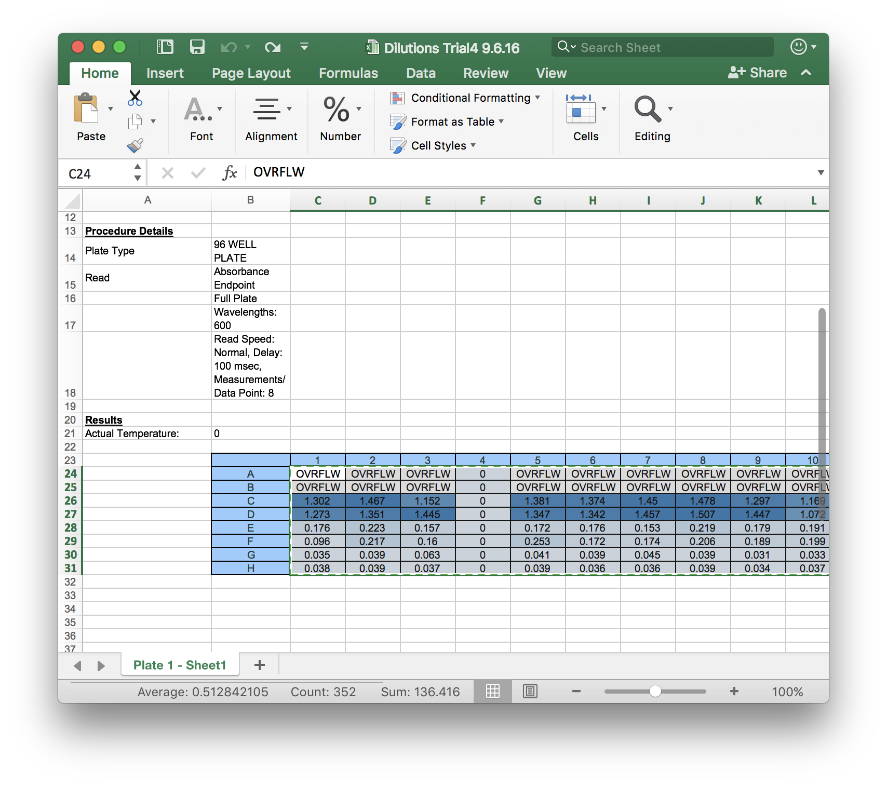
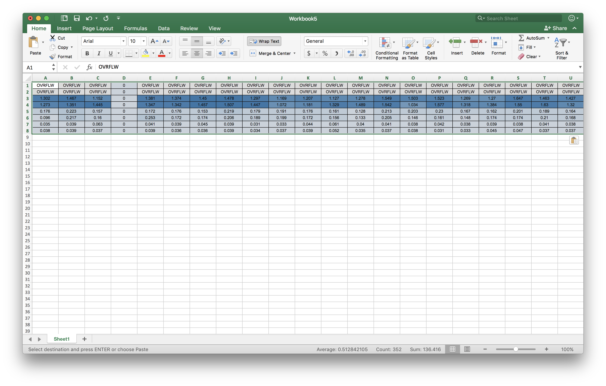
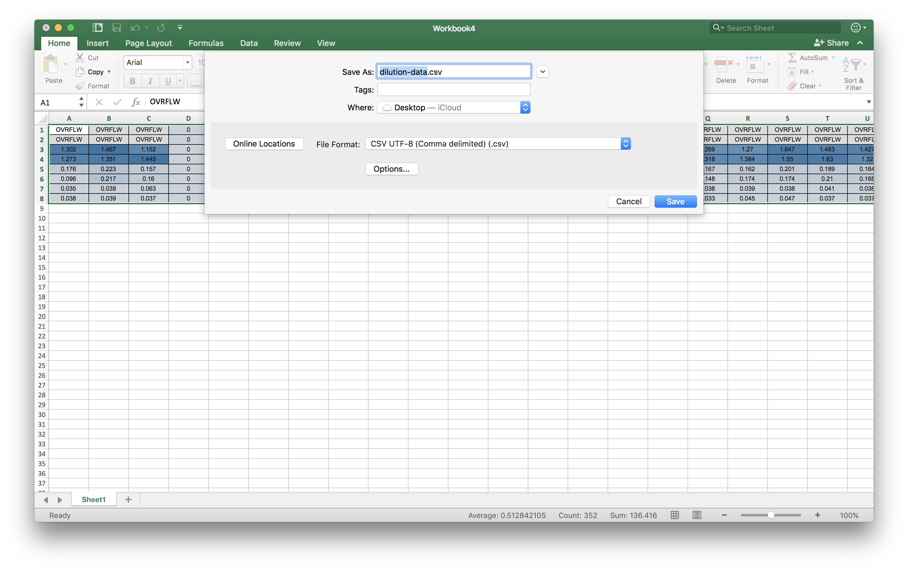

```{r include=FALSE}
knitr::opts_chunk$set(eval = FALSE)
```

#Contents

1. [Dilutions Assignment](#dilutions)
2. [Appendix](#appendix)
  i) [Tutorial data](#dilution-data)
  
  # Dilutions {#dilutions}

This module is intended for use by Dr. Monika Oli's undergraduate microbiology lab course at the University of Florida (2017 CCN: MCB3023L).

## Brief Intro
You are embarking upon a career in microbiology with the wind to your back as you set sail into the Harbor of Oli. Sunlight dances across the deep blue sea of the estuary opening before you. You look around to see twenty-three other sailboats, much like yours, also setting across the water, but on your boat, you are alone. Well, you are almost alone. You have one partner, and by now, he should have noticed you, too. Should a storm begin in the night or should the path be obscured on the map, you must rely on one-another, but before you can rely on your partner, you must be able to rely on yourself. 

### Why Pipetting and Why R?
Pipetting is life. Statistics are life. They exemplify the yin and yang -- the complementary aspects -- of research because the precision of your experimentation will determine your data and your interpretation of data will shape your experimentation. 

Pipetting is the single most common action within almost every wet laboratory, and because assays, titrations, and dilutions are often sequential in nature, pipetting errors can combine and compound rapidly. 

Since Excel's statistical functions are full of lies, and its features are limited, it is better to use R, which is free, open-source, extensible, and gaining popularity amongst statisticians, researchers serious about their statistical analyses, all of the cool kids. In fact, if you are take an upper-division stats class, now, you will have already been introduced to it.

## Quickstart

### Get RStudio.
1. Download RStudio https://www.rstudio.com/products/rstudio/download/. 
2. Install it.
3. Open it up.

### Store and delete values.
4. In the console *pane* in the lower right, type `var1 <- 10`.



5. Notice that var1 is now in the *environment* pane.



6. That number has been stored in that variable (var1).
7. Remove that variable with `rm(var1)`.

### Download, import, and view the data.
8. Open the dilution data in Microsoft Excel.



9. Copy to the top left-hand corner of a new Excel sheet.



10. Save file as "dilution-data" as a .csv on the Desktop.



11. Run this command to bring the data into R.
```{r}
data <- data.frame(read.csv("~/Desktop/dilution-data.csv", header = FALSE))
```
12. See `data` in the environment pane, and click on the arrow next to its name to show that it contains data.
13. Select the table icon to view in the data.

### Clean up the data to make it usable.
13. To convert the "OVRFLW" (overflow) data to a form R can understand, run the following:
```{r}
data[data=="OVRFLW"] <- NA
```
Note: This takes the data frame `data` takes only the part of it that is in `data` (which happens to be the whole thing) that is `==` to "OVRFLW". Also, `x == y` lets R decide whether or not `x` and `y` are equal. `x = y` is a command that tells R to set `x` equal to `y`. `x = y` is functionally similar to `x <- y`.
14. Create a copy with the overflow data omitted using `data2 <- na.omit(data)`.
15. Use the table icon, to view `data2` to make sure no real data was removed.
15-1. If you reviewed `data2` and found a lot of data missing, the column corresponding to whoever caused the problem. At this point, you can also eliminate any columns with zeros, as those data were not read. I have a column of zeros, so, in this example, I am removing `V4`. 
```{r}
data2.1 <- data2[,-c(4)]
```
15-2.If you want to remove rows manually, you can also do that.
```{r}
data2.2 <- data2[-c(1),]
```
16. To set the students the observations (dependent variable) and the concentrations as the variables (independent variable), transpose `data2` and set as `data3`.
```{r}
data3 <- t(data2)
```
17. Your data has weird formatting residual from being exported by Excel. Convert the datatype of your entries to numbers and put them all into a data frame of a matrix so that you can perform arithmetic operations on them. Make sure you specify the correct number of columns. If not, this command will end up shuffling your data.
```{r}
data4 <- data.frame(matrix(as.numeric(data3), ncol = 6))
```

### Analyze your beautiful data.
18. Now, let us take what is your beautiful data and analyze it. First, let's take the averages of the columns.
```{r}
means <- apply(data4, 2, mean)
```
19. Now, let's get the standard deviation of the columns.
```{r}
sdvs <- apply(data4, 2, sd)
```
20. Now, let's make a vector of indices for our dilutions:
```{r}
dilutions <- c(1:6)
```
Note: There are duplicates because each dilution was done in duplicate.
```{r}
plot(dilutions, means,
      ylim=range(c(means-sdvs, means+sdvs)),
      pch=19, xlab="Dilution", ylab="Mean Absorbance +/- SD",
      main="Mean Absorbance vs Dilution"
      )
arrows(dilutions, means-sdvs, dilutions, means+sdvs, length=0.05, angle=90, code=3)
```
21. If you want to do the same but using the base-ten-log values of the data, you can do that:
```{r}
plot(dilutions, log10(means),
      ylim=range(c(log10(means-sdvs), log10(means+sdvs))),
      pch=19, xlab="Dilution", ylab="Log (base 10) Mean Absorbance +/- SD",
      main="Log10 Mean Absorbance vs Dilution"
      )
arrows(dilutions, log10(means-sdvs), dilutions, log10(means+sdvs), length=0.05, angle=90, code=3)
```
22. Now, you may want to plot against your classmates rather than their dilutions, so we need to transpose our data to plot it. The x-axis will tell us which dilution it is.
```{r}
plot(rep(1:6,length(t(data4))/6),t(data4),
     xlab="Dilution", ylab="Absorbance",
      main="Class Absorbance vs Dilution")
```

Note: If you want the x to correspond to the actual dilution, you can do this:
```{r}
plot(rep(c(.01,.01,.001,.001,.0001,.0001),length(t(data4))/6),t(data4),
     xlab="Dilution", ylab="Absorbance",
     main="Class Absorbance vs Dilution")
```
Note: If you want that as log-log...
```{r}
plot(rep(log10(c(.01,.01,.001,.001,.0001,.0001)),length(t(data4))/6),log10(t(data4)),
     xlab="log10 Dilution", ylab="log10 Absorbance",
     main="Class log Absorbance vs log Dilution")
```
23. If, on the other hand, you want individual plots of everyone's dilution data, you can use the `apply` function:
```{r}
apply(t(data4), 2, plot, xlab="Dilution", ylab="Absorbance",
     main="Absorbance vs Dilution")
```
### Conclusion
Congratulations! You have made it to the end of the tutorial!

# Appendix {#appendix}
## Data for dilution tutorial {#dilution-data}

Download from http://www.jonesnoaht.com/dilution-data.csv